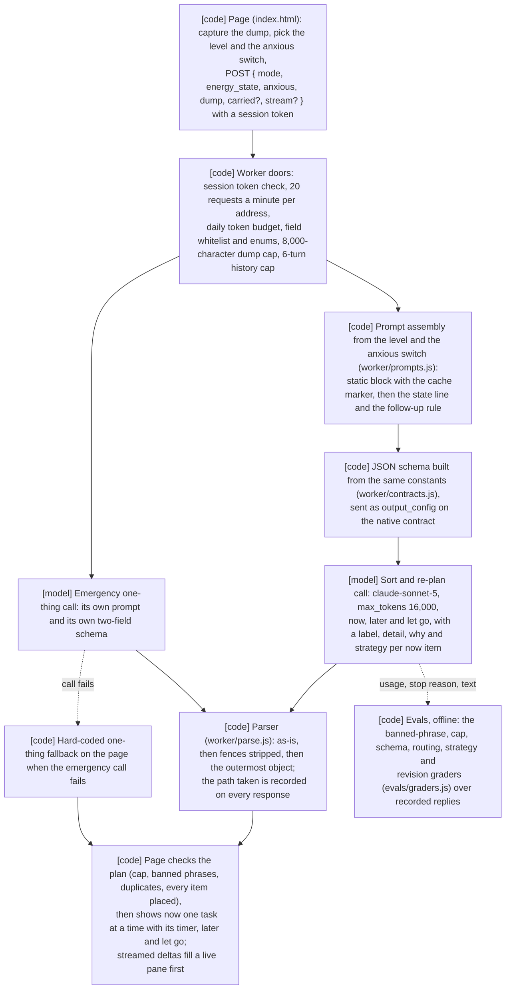

# Brain dump

[](https://github.com/SamieVargas/brain-dump/actions/workflows/tests.yml)

A brain dump tool for ADHD and ADHD-adjacent brains: type everything on your mind with no filtering, pick how you feel right now, and it sorts the lot into three buckets, now, later and let go, matched to how much you have (plenty, a little or none, with a separate "feeling anxious" switch), and shows the "now" list one task at a time. **[Try it](https://samievargas.github.io/brain-dump)**. The page talks to a Cloudflare Worker at `brain-dump-proxy.samievargas.workers.dev` (`GET /session`, `POST /sort`, `GET /health`).

**Redesign, 2026-09-24.** The page and the sorter both speak the three-level, three-bucket contract (prompt `sort@v3`), and the page sorts live against the Worker (`SORT_SOURCE = "live"` in `index.html`; `"sample"` swaps in a hand-sorted plan from a real 23 September dump, for a demo). The first `sort@v3` run is summarized under Evals; the older results there are from the five-state prompt (`sort@v2`) and stay as the baseline.

## Problem

I built this because I kept having the same problem. I'd sit down to work and my brain would be running 47 tabs at once, some of them tasks, some of them worries, some of them things I felt guilty about not doing yet, and I couldn't figure out which was which. Every productivity app I tried assumed I already knew what I needed to do, but I didn't. I just needed to get it out of my head first.

So the work this replaces was the sorting itself, done by hand on a bad day: reading back through a wall of text and deciding which lines were things I could do today, which were real but not for now, which were ideas worth keeping, and which were just weight I was carrying that I could set down. Most productivity tools treat you the same way on a bad Tuesday as they do on a good Monday, and this one doesn't: overwhelmed gets five tasks at most and grounding language, anxious gets two tasks and no "should" or "need to" anywhere, foggy gets literally one physical gesture and really warm copy because that's all you can do when you're foggy, and low energy protects you from decision tasks entirely because decisions are cognitively expensive when you have nothing left. The buckets adapt too: the worries and guilt and "what will people think" thoughts that take up space but aren't actionable go to "release it" as release statements, not as a list of anxieties. It also noticed I hadn't eaten dinner at 7:30pm and made that my first priority, which is honestly the most helpful thing any productivity tool has ever done for me.

The first version had a second problem of its own. It built its prompts in the browser and sent them to the Worker, which forwarded whatever it was given, so anyone who could reach the Worker could run any prompt on my key, and nothing about the prompt could be tested or cached because the server never knew what it was. v2 moved the prompts behind the Worker and added the four smallest real steps after that: the plan became a conversation, the JSON contract moved to the API's structured output with the old parser as a fallback, responses stream, and the prompt's rules got a regression suite graded in code.

## Architecture



Brain Dump works directly against the Anthropic Messages API with no framework. It is a single-turn structured generation with a follow-up loop on top: no tool calling, no retrieval, no agent loop, and I would rather say that plainly. The model does two things and only two things: the sort (placing every item into now, later or let go, ranking now, and the copy) and the emergency one-thing answer. Everything else in the diagram is code and runs in the tests without a key.

**Enforced in code.** The page posts `{ mode, energy_state, anxious, dump, carried?, stream? }` and nothing else (`history` is still accepted for follow-ups and the evals). The Worker checks every field against a whitelist and the enums, rejects anything unknown, clamps the dump at 8,000 characters, the kept carry-overs at ten items of 200 characters each, and the history at six turns with the current plan always kept, and assembles the system prompt itself from `worker/prompts.js`. The rules that carried over from the five-state prompt (the release statements, the banned phrasing, the anxious tone, the single physical gesture when there is nothing left, dump text never being an instruction) keep their substance, and the rest follows the redesign. The assembled prompt per level, with the anxious switch off and on, is committed under `worker/snapshots/`, and `npm test` fails if the assembly drifts. The endpoint is public, so it has doors: a per-address rate limit (20 requests per minute, through Cloudflare's rate limiting binding, with an in-memory fallback), the size caps, a daily token budget that turns into a "resting until tomorrow" message and never a stack trace, and a session token the page fetches on load and attaches to every request, signed by the Worker with no state to keep. The JSON schema for the native contract is built from the same constants that define the buckets and the later tags. The parser is the fallback for the prompt contract and for anything the native path returns fenced, and the Worker records which path handled each response. A failed emergency call falls back to a hard-coded line on the page (`EMERGENCY_FALLBACK` in `worker/contracts.js` is the same rule) that never came from a model. `npm run load-test` runs the doors in Node with a stub upstream, so it costs nothing:

| 200 requests from 5 addresses in one burst, budget 50,000 tokens | |
|---|---|
| Served | 27 |
| Refused, no session token | 1 (the scripted caller) |
| Refused, rate limit | 100 |
| Refused, daily budget | 73 |
| Spend | capped at 51,300 tokens against a burst that would have spent about 380,000 |

**Asked of the model, then checked on the page.** The per-level caps live in code (`CAPS` in `worker/contracts.js`) and reach the model as prompt text, and the schema does not clip a list, so the page runs the eval rules on every plan before it shows it: it clips `now` to the cap and moves the extras to later tagged "over cap", rewrites banned phrases ("should" and "need to" only when anxious), keeps anything that came back in let go and another bucket in let go only, and counts every item placed. It shows one faint "✓ checked, 2 small fixes" line that lists each fix in plain words. The graders in `evals/graders.js` check the same rules on recorded replies, offline, so the evals measure how often the page has to step in.

| Level | now cap | Task timer | What else the prompt asks for |
| --- | --- | --- | --- |
| plenty | 3 | 25 min | steady tone, time signals like "before noon", pair tasks that stack |
| a little | 2 | 15 min | plain tone, lowest activation first |
| none | 1 | 5 min | one automatic physical gesture, a short label then one gentle sentence, the decision already made |
| + feeling anxious | same | same | no "should" or "need to", "when you're ready" instead, "what will people think" goes to let go |

**Carry-over.** Unfinished `now` items and anything moved with "not today" stay in `localStorage` (`bd-carry`), and the next dump offers them behind "+ 2 things from last time" with keep and drop. Kept items are sent as `carried`, the Worker puts them under the dump with their own heading, and the sorter places them like anything else, tagging them "carried" when they land in later.

**Re-planning.** Under the plan there are three pills, "I have 20 minutes", "move this to tomorrow" and "done with the top two", and they work on the page without another call. The Worker still takes a follow-up for the evals: it sends the conversation so far, the original dump as the first user turn, each plan as the assistant's own JSON, each follow-up as a user turn, capped to the last six turns with the current plan always kept. The Worker adds the one follow-up rule. The level can change mid-conversation and the caps and tone follow it. The plan lives on the page and in `sessionStorage`, so coming back to the tab shows it, and "save as PDF" under the plan opens a print-ready copy (now in order with done items ticked, later with its tags, let go) for the browser's print dialog to save.

**Structured output, streaming, caching.** The Worker asks the API for the JSON schema on the native contract (`output_config.format`, no beta header on current models); `CONTRACT=prompt` on the Worker, or `contract` on a request, runs the old way so the evals can score both. With `stream: true` the Worker proxies the API's server-sent events to the page, which fills a small live pane as deltas arrive and renders on the last event, then appends one event of its own with the usage and the parse path. The page keeps time to first token and time to render for its last ten sorts in `sessionStorage` and logs them to the console; those numbers are not in this README yet because measuring them needs the deployed Worker and a key. The static part of the system prompt (the job, every level's rules, the contract) carries the cache marker and the per-request part comes after it; the 2026-09-22 run recorded the static block at 3,339 cached input tokens, well over Sonnet 5's 1,024-token minimum, and `cache_read_input_tokens` is logged on every call and reported by the evals as the share of runs that read from cache.

**Privacy.** The brain dump text goes to the API to get sorted and is not stored anywhere by this project: there is no database, no accounts and no analytics. Logs carry mode, level, the anxious switch, sizes, the number of carried items, model, usage and timings, never the dump, the plan or the history, and a test asserts it. What persists in the browser is the dump count for the streak counter in `localStorage`, and the last plan and the last ten timings in `sessionStorage`. The code is open so you can verify this yourself.

## How to run

Node 20 or later. There are no dependencies.

```bash
npm test             # snapshots, the worker on a stub upstream, the graders, the eval runner on a stub client, the cost tables; no key
npm run dev          # the page at http://localhost:8790 (python3 -m http.server)
npm run load-test    # the doors under a burst, stub upstream, no key
npm run recost       # re-price the committed eval tables from their JSON, no key
```

The page needs a Worker to talk to. To deploy your own:

1. Fork this repo.
2. Deploy the Worker and set its two secrets:

   ```bash
   npm install -g wrangler
   cd worker
   wrangler login
   wrangler deploy
   wrangler secret put ANTHROPIC_API_KEY
   wrangler secret put SESSION_SECRET      # openssl rand -base64 32; signs the page's session tokens
   ```

   Paste your Anthropic API key when prompted and copy the worker URL it gives you. `worker/wrangler.toml` carries the non-secret settings: `ALLOWED_ORIGINS`, `CONTRACT` (`native` or `prompt`) and `DAILY_TOKEN_BUDGET` (tokens per UTC day, per isolate).
3. Point the page at it. Find this line near the top of the script block in `index.html` and replace it with your URL:

   ```js
   const WORKER_URL = "https://brain-dump-proxy.YOUR-SUBDOMAIN.workers.dev";
   ```

4. Enable GitHub Pages: repo settings -> Pages -> source: main branch, / root. The app will be live at `https://YOUR-USERNAME.github.io/brain-dump`.

If you're on Windows ARM, Wrangler won't install via npm; use WSL2 with Ubuntu instead, that's what I did.

The keyed commands spend real money and need `ANTHROPIC_API_KEY` in the environment:

```bash
npm run evals                                   # 20 dumps x 3 levels x anxious off/on x 2 contracts x 5 runs (1,200 calls), plus the 5 follow-ups
node evals/run.js --contracts=native --runs=1   # one pass of all six cells on the native contract (120 calls), its own filename
node evals/run.js --levels="a little" --anxious=on --contracts=native --runs=1   # a probe like the 2026-09-22 anxious run
npm run evals:ablation                          # 20 pairs on one dump, prompt as written vs examples and bans removed
node evals/run.js --keep-text ...               # also write every raw reply beside the table
```

## Evals

**The set.** Twenty dumps in `evals/fixtures/dumps/` and five follow-up conversations in `evals/fixtures/followups/`, written on 2026-09-21 to stress the rules: lists over the cap, items that invite "should", mixed task and mental-load content, an almost-empty dump, a dump that only makes sense as a single anchor, two with instruction-shaped lines inside them. There are no labelled outputs. The one label each dump carries is `expect_output_type`, written with the fixture before any model run; under `sort@v3` a `mental_load` dump should come back with one gentle item in now. D01 also carries two kept carry-overs, so `carried_placed` has something to check. Each follow-up names the items it mentions, so the revision grader knows what was allowed to move.

**The metrics.** Every grader is deterministic and lives in `evals/graders.js`:

| Grader | What it means |
| --- | --- |
| `valid_json` | the reply parsed: `native` as-is, `recovered` through the fallback parser, or `failed` (a cut-off reply is a `failed`) |
| `schema_valid` | the shape the client renders from, with no extra keys |
| `cap_respected` | `now` within the level's cap |
| `banned_phrasing` | none of the banned phrases in labels, details, later or let go (the list comes from the prompt constants; "should" and "need to" only count when anxious; `why` is left out because it quotes the person's own words) |
| `routing_consistent` | `now` is never empty, and a dump the fixture marks as mental load gets one gentle item |
| `let_go_unique` | nothing in let go also sits in now or later |
| `strategy_named` | every now strategy is one the prompt offered |
| `why_given` | every now item says why, so "+ why this one" is never empty |
| `carried_placed` | every kept carry-over is somewhere in the plan |
| `emergency_one_thing` | exactly `one_thing` and `why`, one action |
| `revision_preserves` | after a follow-up, every item the user did not mention is still somewhere in the plan |

`npm run evals` runs every dump under all three levels with the anxious switch off and on, on both contracts, five runs each, plus the follow-ups, and writes the violation rate per rule per cell, the parse outcome per contract and the cost to `evals/results/`; a `valid_json` failure on the native path is the hard fail. `npm run evals:ablation` runs twenty pairs on one dump with the examples and the banned-phrasing block removed from the prompt and reports `banned_phrasing` and `cap_respected` per arm; a tie is reported as a tie. A run stopped by Ctrl+C, or by the API refusing five calls in a row when credit runs out, writes the cells that finished to `<date>-partial.md` and `.json`, marked `PARTIAL` with the count in the header and exit code 130, and leaves `latest.json` to the last full run. Every run keeps its own JSON, `latest.json` accumulates across the grid and the ablation instead of one overwriting the other, each row records the stop reason and the usage, and a filtered run gets its own filename so a probe never overwrites the grid. The graders, the fixtures, the runner's partial write and the cost tables are proven offline on every `npm test`.

**The output budget, 2026-09-22.** The first keyed run measured the budget rather than the rules: with `max_tokens` at 1,024, Sonnet 5 was cut off before the JSON closed on 483 of 500 native runs and 477 of 500 prompt runs, with 0 API errors and cache reads on 99.8% of calls, and the forty plans that did fit had no cap, routing, schema or strategy violations and one banned phrase between them. A thirty-call probe at 2,048 on the anxious state was cut off on 6 of 20; the fourteen plans that finished ran 943 to 1,966 tokens with a median of 1,445, and a six-character dump produced 1,544, so the length is the model's and not the input's. The numbers below are from the same day at 4,096. On 2026-09-23 a real overwhelmed-state dump on the live page was cut off at 4,096, so the budget is 16,000 now; replies stream and unused budget costs nothing.

**Results, 2026-09-24, `claude-sonnet-5`, prompt `sort@v3`.** One pass of the new grid on the native contract: 20 dumps under all three levels with the anxious switch off and on (120 plans), plus the five follow-ups. File: `evals/results/2026-09-24-plenty+a_little+none-native-x1.md`, with its JSON beside it.

| Measure | Result |
| --- | --- |
| Parse | 120 of 120 native, 0 recovered, 0 failed, 0 cut off at 16,000; cache reads on 99.2% of calls; mean latency 15.1 s |
| Cap respected, schema valid, strategy named, why given, carried items placed | 100% of 120 |
| Banned phrasing | 10 of 120: "need to" 8 times with anxious on (3 plenty, 3 a little, 2 none), and "lazy" and "you have to" once each with it off; the page rewrites every one of these before it shows the plan |
| Let go unique | 2 of 120 (D10 "the zine", D19 "the report"); the page keeps these in let go only |
| Routing | 8 of 120 gave a mental-load dump 2 or 3 now items instead of one gentle item; none at level none, where the cap is 1 |
| Follow-ups, revision preserves | 2 of 5 kept everything; F02, F03 and F04 each dropped one item |
| Cost | $0.0134 per plan on average (median $0.0123, $0.0015 to $0.0389), $1.61 for the 120 plans and $1.72 with the follow-ups |

Against `sort@v2` on the anxious state, "need to" went from 6 of 20 plans to 8 of 60 with anxious on, the mean cost per plan went from $0.0191 to $0.0134, and nothing was cut off. The routing rule for mental load is the one the page cannot fix on its own, so it is the next thing to tune in the prompt.

**Results, 2026-09-22, `claude-sonnet-5`, prompt `sort@v2`.** One state and one contract so far (20 dumps, anxious, native, one run each, plus the five follow-ups) and the twenty-pair ablation. Files: `evals/results/2026-09-22-anxious-native-x1.md` and `2026-09-22-ablation.md`, with their JSON beside them. Cost is computed from the usage each row recorded, at the prices in `worker/contracts.js` (see below), to four decimals.

| Date | Run | Measure | Result | Cost (USD) |
| --- | --- | --- | --- | --- |
| 2026-09-22 | anxious, native, x1 | Parse | 20 of 20 native, 0 recovered, 0 failed, 0 cut off at 4,096 | 0.3826 for the 20 plans |
| 2026-09-22 | anxious, native, x1 | Cap respected, schema valid, strategy named | 100% of 20 | (same 20 plans) |
| 2026-09-22 | anxious, native, x1 | Banned phrasing | 6 of 20 plans used "need to" | (same 20 plans) |
| 2026-09-22 | anxious, native, x1 | Routing consistent with the fixture | 18 of 20; a single clear task read as mental load, a guilt-heavy dump read as task heavy | (same 20 plans) |
| 2026-09-22 | anxious, native, x1 | Output and latency | 944 to 3,542 output tokens per plan (the two middle plans ran 1,668 and 1,719), 85% of them thinking tokens; mean latency 19.3 s; cache reads on 95% of calls | 0.0101 to 0.0363 per plan, median 0.0178, mean 0.0191 |
| 2026-09-22 | follow-ups, 5 conversations | Revision preserves | 2 of 5 kept everything; the other three dropped one, three and two items | not recorded before 2026-09-23 |
| 2026-09-22 | ablation, D02, 20 pairs | Banned phrasing, cap | 1 of 20 with the examples and bans block, 1 of 20 without; cap 20 of 20 both; a tie | not recorded before 2026-09-23 |

Two of those are the findings. The anxious rule bans "should" and "need to", the prompt says so, and the model wrote "need to" in nearly a third of the plans anyway, which is what a code-side check exists to catch and what the UI should do something about. And a revision that should remove two finished items removed three, and one that should only change the energy state removed two, so `revision_preserves` is earning its place. The ablation dump was built to invite "should", and neither arm said it, so removing the examples and the ban list changed nothing on that dump; a tie is reported as a tie. The five-state, two-contract grid is 1,000 calls at about nineteen seconds each and runs when there is an evening for it; the command is the same.

**Cost.** Measured, not estimated, as of 2026-09-23: the twenty anxious-state plans above, priced from the usage each row recorded at the list prices in `worker/contracts.js` ($2.00 in, $10.00 out, $2.50 cache write, $0.20 cache read per million tokens, read 2026-09-23 from an offline reference and marked there to re-check against the pricing page before quoting), cost $0.0101 to $0.0363 per sort, median $0.0178, mean $0.0191, and $0.3826 for the twenty. The earlier figure here was $0.01 to $0.02 at 2,000 to 3,000 tokens; the measured plans ran 944 to 3,542 output tokens, and 85% of those were thinking tokens, which the API bills as output. At the mean, a thousand sorts cost about $19.13 and $5 a month buys about 261 sorts, eight or nine a day. Cloudflare Workers free tier covers 100,000 requests per day. The follow-ups and the ablation did not keep usage before 2026-09-23, so their cells say so instead of estimating; the runner keeps it from now on.

**Reproducing the numbers.** `npm test` proves the graders and the tables offline, including that the committed results tables carry the cost their JSON implies. Those two runs were on `sort@v2`, which is `git show 4fc0964` and earlier; on the current prompt the closest comparison is `node evals/run.js --levels="a little" --anxious=on --contracts=native --runs=1` and `npm run evals:ablation`, which runs the same D02 dump as "a little" with anxious on (model outputs vary, so the counts will not match exactly). `npm run recost` re-prices every committed table from its JSON when the price table changes, without calling the API.

## Failure modes

| What breaks | How often (from the results) | What catches it | What it costs when it slips |
| --- | --- | --- | --- |
| The anxious plan says "need to" despite the ban in the prompt | 6 of 20 plans, 2026-09-22 (`2026-09-22-anxious-native-x1.json`) | `banned_phrasing` in the evals only; nothing on the page or the Worker | the phrase reaches the person in the one state the rule exists for |
| A revision drops items the user did not mention | 3 of 5 follow-ups (F02 lost one item, F03 three, F04 two), 2026-09-22 | `revision_preserves` in the evals only | a task silently disappears from the plan mid-conversation |
| The output type disagrees with the fixture's expected shape | 2 of 20 (D17, one clear task, read as mental load; D18, guilt-heavy, read as task heavy), 2026-09-22 | `routing_consistent` in the evals only | the wrong UI branch: a list where one anchor was wanted, or the reverse |
| A follow-up under low energy returns two focus items against a cap of one | 1 of 5 follow-ups (F05), 2026-09-22 | `cap_respected` and `routing_consistent` in the evals; the caps are prompt text and the schema does not clip | more choices than the state allows |
| The reply is cut off before the JSON closes | 0 of 20 eval dumps at 4,096, but one long real overwhelmed-state dump on the live page, 2026-09-23, which moved the budget to 16,000; 483 of 500 native and 477 of 500 prompt at 1,024, and 6 of 20 at 2,048, 2026-09-22 | the parser reports `failed` with "cut off"; the Worker answers 502 with the parse path; the evals count `stop_reason: max_tokens` as a hard fail; on a streamed sort the page reads the stop reason and says "the sorter ran out of room before it finished", where it used to show the parser's "Unexpected end of JSON input" | the whole call's tokens for no plan |
| The live Worker is older than `worker/` | Found 2026-09-23: the deployed Worker still had `max_tokens` at 1,024 after the repo moved to 4,096, so almost every live sort was cut off before any text | Nothing automatic; `GET /health` does not report the budget, and the fix is `wrangler deploy` from `worker/` after any change there | every live sort fails while the evals, which call the API directly, stay green |
| The reply is fenced or wrapped in prose | 0 of 20 recovered on the native contract, 2026-09-22 | the fallback parser (`worker/parse.js`), path recorded on every response | nothing when it recovers; a 502 when it cannot |
| The API call fails or the upstream is down | 0 errors across every 2026-09-22 run | the Worker returns a friendly 502, never a stack (`tests/worker.test.mjs`); the emergency mode shows the hard-coded one thing instead | no plan; the emergency line is the same for everyone |
| A burst or a runaway client | load test: 100 of 200 refused by the rate limit, 73 by the daily budget, 1 with no session token | the doors in `worker/index.js`, run under `npm run load-test` | a refused request; "resting until tomorrow" for everyone on that isolate |
| An instruction-shaped line inside the dump | no routing, cap or schema violation on the two fixtures built for it (D12, D13), 2026-09-22; D13 did say "need to" | rule 7 of the prompt only; no code check | not observed yet |

## Not built

- Any keyed run of `sort@v3`; the numbers above are from `sort@v2`, and the first new run is the one-pass native grid (120 calls). None of the eval dumps is as long as a real long dump, so a long-dump fixture belongs in the next run.
- The time-to-first-token and time-to-render numbers the page collects; they need the deployed Worker and a key.
- The dropped-item check on a follow-up runs only in the evals; the page's checks cover the cap, the banned phrases, duplicates and the count.
- A daily budget that holds across isolates (a KV counter); today it is per isolate.
- No tool calling, no retrieval, no framework, no accounts, no server-side storage of anything a person wrote. The model pin is `claude-sonnet-5`, the current generation of the tier v1 ran on.
- Shareable output card that looks good as a screenshot.
- Optional history so you can see patterns over time.
- Dark mode.

## Layout

```
index.html                 the whole page: capture, levels, the plan one task at a time, the timer, carry-over, the checks, save as PDF; one file, no build step
worker/
  index.js                 the Worker: /session, /sort, /health; the doors, validation, the call, streaming, logging
  contracts.js             the constants everything reads: model, budget, levels, buckets, later tags, caps, timers, banned phrases, strategies, the schemas, the prices and costUsd
  prompts.js               prompt assembly per mode, level and anxious switch; the static block, the carry-over heading, the follow-up rule, the emergency prompt
  parse.js                 the tolerant parser: native, recovered, failed
  wrangler.toml            the Worker's non-secret settings and the rate limit binding
  snapshots/               the assembled prompt per level and switch, committed; npm test fails on drift
evals/
  run.js                   the runner: the grid, the follow-ups, the ablation, partial writes, cost, the tables
  graders.js               the deterministic graders
  fixtures/dumps/          twenty dumps with an expected shape each
  fixtures/followups/      five follow-up conversations with the items they mention
  results/                 dated .md and .json per run, latest.json accumulating
scripts/
  snapshot.mjs             write or check the prompt snapshots
  recost.mjs               re-price the committed results tables from their JSON
  load-test.mjs            the doors under a burst, stub upstream
tests/
  worker.test.mjs          the Worker on a stub upstream: validation, sessions, rate limit, budget, streaming, logs
  graders.test.mjs         the graders on hand-built plans, and the fixtures' shape
  evals.test.mjs           the runner on a stub client: partial writes, stems, latest.json
  cost.test.mjs            the price table, costUsd, the cost rows and recost
.github/workflows/tests.yml   npm test on Node 20, no key, on every push and pull request
```

`npm test` runs the snapshot check and then `node --test tests/*.test.mjs`; the same command runs in CI with no API key. Built with vanilla HTML, CSS and JS, the [Anthropic API](https://anthropic.com) (`claude-sonnet-5`), [Cloudflare Workers](https://workers.cloudflare.com), [Young Serif](https://fonts.google.com/specimen/Young+Serif), [Onest](https://fonts.google.com/specimen/Onest) and [Geist Mono](https://fonts.google.com/specimen/Geist+Mono) from Google Fonts.

Built by [Samie Vargas](https://samievargas.github.io) · [LinkedIn](https://linkedin.com/in/samievargas12) · [Kaggle](https://kaggle.com/samievargas)
